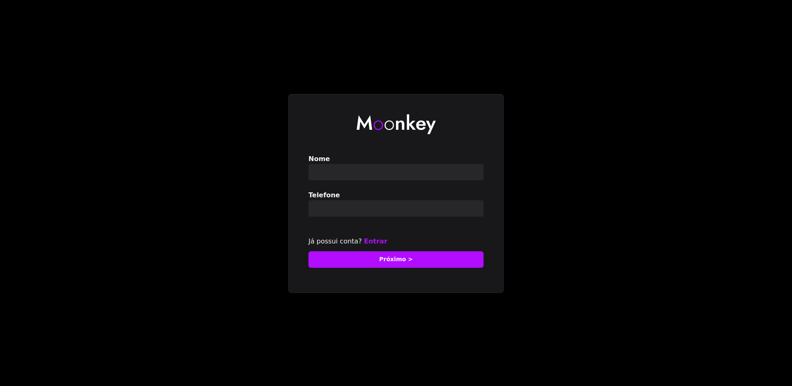

  
  <h1 align="center">Sistema Moonkey finanças</h1>
  

  
  

[circleci-image]: https://img.shields.io/circleci/build/github/nestjs/nest/master?token=abc123def456
[circleci-url]: https://circleci.com/gh/nestjs/nest

## Description

Sistema para gerência de produtos, com uma interface agradável e receptiva, controle o fluxo de estoque da sua loja de forma simples e rápida. Receba lembretes de renovação de compras do seu produto via WhatsAPP. Emissão de nota fiscal também será uma funcionalidade primordial da aplicação.

## Tecnologias

 - <b>React</b>
 - <b>Vite</b>
 - <b>Typescript</b>
 - <b>GraphQL</b>

## Funcionalidades

- [X] Tela Regitro de usuários
  - [X] integração Regitro de usuários
- [X] Tela de Login de usuários
  - [X] integração de Login/autentcação de usuários
- [X] Tela de DashBoard de produtos
  - [X] integração com funcionalidades CRUD de produtos
...

## Fale comigo

- Author - [Bruna Cardoso](https://github.com/BrunaCardoso7)
- LinkedIn - [@brunaCardoso](https://www.linkedin.com/in/bruna-cardosoads/)